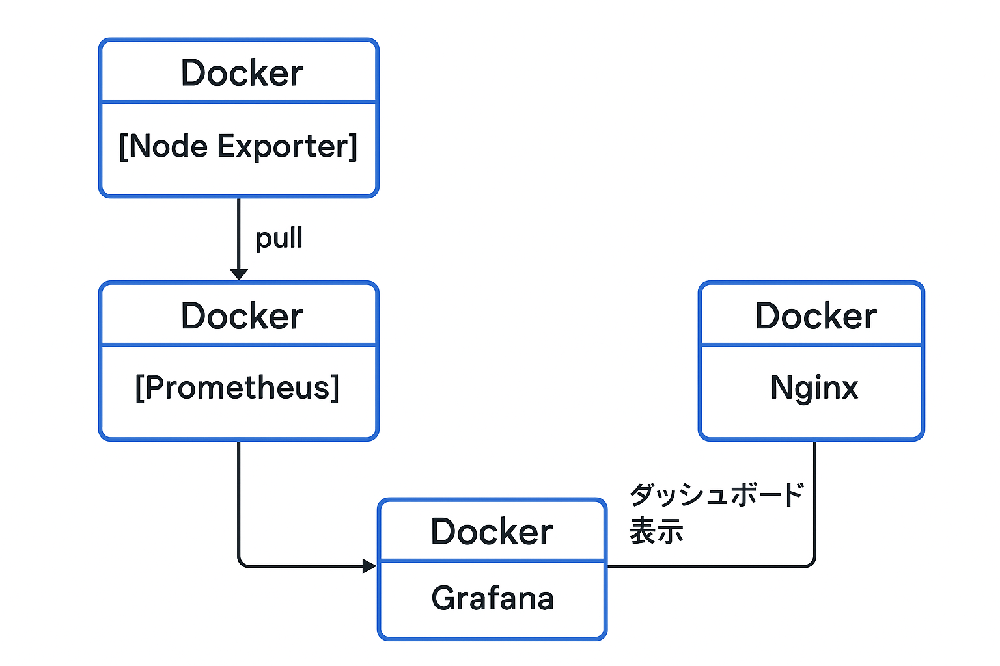

# Monitoring-tools (Dockerized Grafana)

- [概要](#概要)
- [セットアップ手順](#セットアップ手順)
  - [開発環境で試す場合](#開発環境で試す場合)
  - [本番環境の設定](#本番環境の設定)
  - [Docker Composeの実行](#docker-composeの実行)
- [トラブルシューティング](#トラブルシューティング)
- [フィードバック・お問い合わせ](#フィードバックお問い合わせ)

## 概要

Monitoring-toolsの概要は、Dockerで構築されたGrafanaを利用するための環境を提供します。

Grafanaはモダンなグラフを表示するサービスとして有名です。


- [Grafanaサイト](https://grafana.com/ja/)

Monitoring-toolsではシステムのリソースを監視するために、Node Expoter、Prometheusというツールを使用し、Prometheusのソースを利用してGrafanaでモダンなグラフとして表示します。



DockerおよびDocker Composeが導入済みならすぐに始められます。

## セットアップ手順

確認済みのDocker及びDocker Composeのバージョン

|名前|バージョン|
|----|----|
|Docker|26.1.4以降|
|Docker Compose|v2.27.1以降|

任意のディレクトリにて、クローンもしくはtar.gzをダウンロードします。

```bash
git clone https://github.com/kenno-warise/monitoring-tools.git

cd monitoring-tools
```

```bash
curl -L https://github.com/kenno-warise/monitoring-tools/archive/refs/tags/vx.x.x.tar.gz

tar -xvzf monitoring-tools-x.x.x.tar.gz

cd monitoring-tools-x.x.x
```

Monitoring-toolsが必要とするディレクトリ構成一覧（それ以外のファイルはCI/CDに必要なファイルなので無視しても大丈夫です）

```
monitoring-tools
├── .env
├── compose.yml
├── nginx
│   ├── conf.d
│   │   └── dev.conf
│   └── templates
│       └── default.conf.template
├── prometheus
│   └── prometheus.yml
```

各ファイルの役割

|ファイル|役割|
|----|----|
|.env |本番環境での環境変数用の設定ファイル |
|compose.yml |Docker Composeの設定ファイル |
|nginx |Nginxのプロキシ設定が定義されているテンプレートファイル（本番環境用）と設定ファイル（開発環境用）が配置されているディレクトリ|
|prometheus |メトリクスを収集するたの設定ファイルが配置されているディレクトリ|

### 開発環境で試す場合

開発環境でMonitoring-toolsを試す場合は、今のところルート「/」のマウント伝播タイプをsharedに変更する必要があります。

なぜならNode Expoterコンテナはホスト側のルートと同期をしてリソースを収集するので、同期後もデータが更新されるようにするためです。

ただしこれは開発環境の場合のみかもしれません。

ルートのマウントの伝播タイプの確認
```bash
findmnt -o TARGET,PROPAGATION /
```

ルートのマウントの伝播タイプをsharedに変更
```bash
sudo mount --make-rshared /
```

### 本番環境の設定

Monitoring-toolsに必要な環境変数を設定する.envファイルを作成

この環境変数はNginxとGrafanaに割り当てる変数で本番環境での設定に有効です。

※ `.env`を編集したらDockerをダウンさせて起動してください。

- IP_ADDRESS：サーバーのIPアドレス
- FREE_DOMAIN：無料ドメインorサブドメイン
- DOMAIN：SSL認証を受けているドメイン
- TARGET_IP：セキュリティ上、アクセスが許可されるIPアドレス
- GF_USER：Grafanaサービスのログインユーザー名
- GF_PASSWORD：Grafanaサービスのログインパスワード
- GF_SMTP_USER：SMTPのユーザー名
- GF_SMTP_PASSWORD：SMTPのパスワード

'TARGET_IP'ではセキュリティ上の理由から、許可されたIPアドレスのみのアクセスを有効にします。

例えば現在利用中のWi-Fiルーター経由のIPアドレスを取得するには以下を実行します。

※　Wi-Fiルーター経由のIPアドレスは定期的に変化する場合があるので、その都度変更が必要です。

```bash
curl -s ifconfig.me
```

例

```
IP_ADDRESS=111.222.33.444
FREE_DOMAIN=example.ne.jp
DOMAIN=example.com
TARGET_IP=00.11.22.33
GF_USER=admin
GF_PASSWORD=admin
GF_SMTP_USER=example@gmail.com
GF_SMTP_PASSWORD=password
```

.envファイルはカレントディレクトリに配置するとDocker Composeの実行時に自動で読み込まれます。


```
monitoring-tools
├── .env
├── compose.yml
├── ...
```

### Docker Composeの実行

**開発環境で実行する場合**

```bash
sudo docker compose --profile dev up -d
```

起動後、少し時間をおいて127.0.0.1にアクセスすると、ログイン画面が表示されます。

**本番環境で実行する場合**

```bash
sudo docker compose --profile prod up -d
```

'FREE_DOMAIN'に設定したドメインにアクセスすると、ログイン画面が表示されます。


必要であれば日本語設定も行えます。

- 画面右上のアイコンをクリックしProfileに移動
- Preferences項目の「Language」から日本語を選択
- 確認してSave


## トラブルシューティング

一部の環境で起こりうる問題と対策を以下にまとめています：

- [トラブルシューティングガイド](docs/troubleshooting.md)

## フィードバック・お問い合わせ

- バグ報告・改善提案は[Discussion](https://github.com/kenno-warise/monitoring-tools/discussions/56)へどうぞ。
